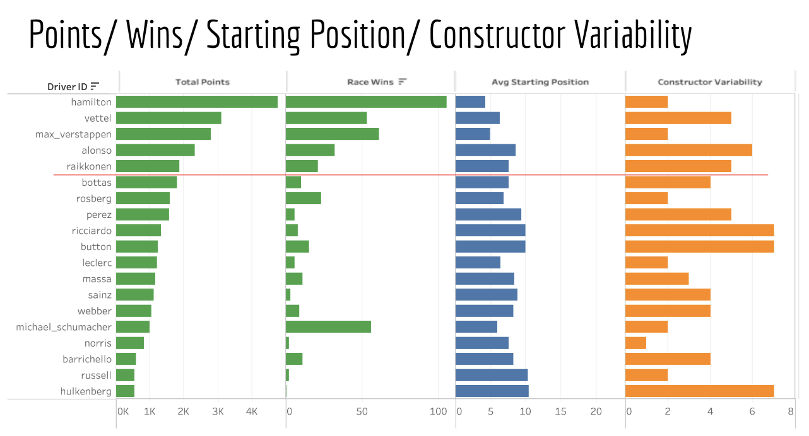

SQL • Data Analytics • Tableau • Sports Analytics
# F1 Performance Analytics | SQL + Tableau

An end-to-end data analytics project analyzing 20+ years of Formula 1 race data (2000–2024) to evaluate driver and constructor performance using SQL-based KPI modeling and Tableau dashboards.

This project demonstrates how structured relational race data can be transformed into performance insights through SQL analysis and visualized using interactive dashboards.

---

# Project Overview

This project analyzes historical Formula 1 race data to evaluate both long-term career performance and short-term performance momentum of drivers and constructors.

The workflow mirrors a typical analytics pipeline:

1. Extract structured race data  
2. Transform and aggregate metrics using SQL  
3. Build performance KPIs  
4. Visualize insights using Tableau dashboards  

The objective is to identify performance patterns and compare historical consistency with recent performance trends.

---

# Key Business Questions

This analysis explores several questions:

- Which drivers accumulate the highest career points?
- Which drivers have the strongest win records?
- How does starting grid position relate to race outcomes?
- Which constructors demonstrate the most consistent performance?
- Which drivers show strong recent momentum relative to their career averages?

---

# Dataset

**Source:**  
Formula 1 World Championship Dataset  
https://www.kaggle.com/datasets/rohanrao/formula-1-world-championship-1950-2020

Key tables used:

- `results`
- `drivers`
- `constructors`
- `races`

The dataset was imported into **SQLite** for SQL-based analysis.

---

# Tools Used

### SQL (SQLite)
Used for data transformation and KPI generation.

Key SQL concepts used:

- JOIN operations across relational tables  
- GROUP BY aggregations  
- Common Table Expressions (CTEs)  
- KPI metric calculations  
- Filtering and ranking  

### Tableau
Used to build dashboards visualizing driver and constructor performance trends.

### DB Browser for SQLite
Used for SQL development and database management.

---

# Key Performance Metrics

The project models several analytical KPIs.

### Career Average Points
Average points scored per race across a driver's career.

### Recent Performance
Average points scored in recent races to evaluate current momentum.

### Momentum Score


momentum_score = recent_avg_points - career_avg_points


Positive values indicate improving performance.

### Overperformance Score


overperformance_score = grid_position - finishing_position


Positive values indicate drivers finishing ahead of their starting position.

---

# SQL Analysis Pipeline

The SQL scripts follow a structured analysis workflow:

1. Driver career totals  
2. Driver efficiency metrics  
3. Constructor average performance  
4. Post-2014 constructor performance comparison  
5. Driver momentum analysis  
6. Final KPI table generation for dashboard visualization  

---

# Dashboard

A Tableau dashboard was created to visualize driver and constructor performance across multiple dimensions.

Example dashboard view:



Key dashboard components include:

- Driver performance comparison  
- Race wins and points distribution  
- Average starting position trends  
- Constructor variability analysis  

---

# Example Insights

### Long-Term Driver Dominance
Lewis Hamilton leads in total career points, followed by Sebastian Vettel and Max Verstappen, reflecting sustained dominance during the hybrid era.

### Constructor Stability
Mercedes demonstrates both high points accumulation and stable performance across multiple seasons.

### Grid Position vs Race Outcome
Several drivers consistently finish ahead of their starting grid positions, suggesting strong race execution and strategy.

### Momentum vs Career Performance
Recent momentum does not always align with long-term career averages, highlighting emerging competitive drivers.

---

# Repository Structure

```
f1-performance-analytics
│
├── README.md
├── data
│ └── source-note.md
│
├── sql
│ ├── 01_driver_career_totals.sql
│ ├── 02_driver_avg_points.sql
│ ├── 03_constructor_avg_points.sql
│ ├── 04_constructor_post2014.sql
│ ├── 05_momentum_top10.sql
│ └── 06_final_driver_kpi_table.sql
│
├── dashboard
│ ├── tableau-dashboard-overview.png
│ ├── driver-kpi-chart.png
│ └── constructor-analysis.png
│
├── docs
│ └── project-summary.md
│
└── presentation
└── F1_final_project.pdf
```

---

# Future Improvements

Potential future extensions include:

- Lap time performance analysis  
- Driver consistency metrics  
- Season-by-season performance comparisons  
- Predictive race outcome modeling  
- Expanded Tableau dashboards  

---

# Author

Sophia Choi  
Business Technology Management | Data Analytics | SQL | Tableau
